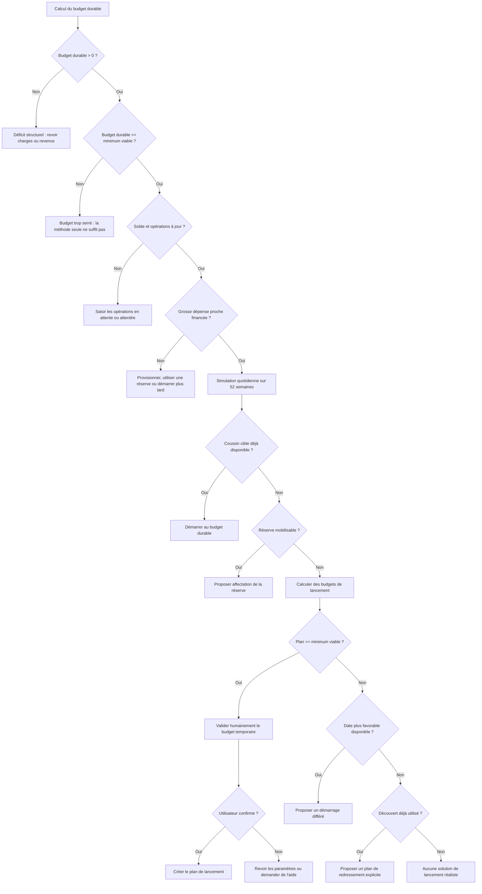

# PRD complémentaire — REBOOT
## Phase de démarrage, coussin de trésorerie et validation de faisabilité

**Statut :** spécification normative complémentaire  
**Version :** 1.1  
**Date :** 2 août 2026  
**Audience :** Codex et agents de développement  
**Document parent :** `PRD_Budget52_Codex_v1.1.md`  
**Nom produit :** REBOOT — *Regain Expenses, Back On Our Track*

> **Note d’intégration :** la formule du coussin et de l’écart disponible est
> clarifiée par l’[ADR-0013](adr/0013-startup-balance-and-cash-cushion.md),
> validé après rédaction de ce complément. L’objectif de solde, l’amplitude du
> coussin et son financement propre ou bancaire sont calculés séparément.

**Évolution 1.1 :** ajout de la composition du foyer, des unités de consommation, du périmètre du budget hebdomadaire et des indicateurs relatifs de faisabilité.

---

# 0. Instructions impératives pour Codex

Ce document complète le PRD principal et devient la source de vérité pour la phase de démarrage.

En cas de contradiction :

1. ce document prévaut pour tout ce qui concerne le démarrage, la trésorerie de lancement, le coussin, le découvert et la faisabilité du budget ;
2. le PRD principal reste applicable pour le reste du produit ;
3. toute ambiguïté résiduelle doit être signalée avant implémentation ;
4. aucune formule alternative ne doit être inventée sans ADR validé.

Ce complément modifie notamment les règles suivantes du PRD principal :

- la stratégie annuelle « Stable » ne doit pas être proposée comme choix de démarrage par défaut si la trésorerie de lancement n’est pas validée ;
- la projection de trésorerie de 60 ou 90 jours reste disponible en fonctionnement courant, mais l’évaluation initiale doit obligatoirement simuler au moins 52 semaines ;
- la marge de sécurité annuelle, le coussin de trésorerie et l’épargne de précaution sont trois concepts distincts ;
- un budget annuel équilibré ne suffit pas à autoriser le démarrage immédiat au budget durable ;
- l’application doit vérifier la faisabilité humaine du budget proposé, pas uniquement sa validité mathématique ;
- la faisabilité doit être contextualisée par la composition du foyer, le périmètre réel du budget hebdomadaire et des ratios en pourcentage ;
- aucun seuil universel en euros par personne ne doit être présenté comme une vérité financière.

---

# 1. Problème produit

REBOOT calcule un montant hebdomadaire soutenable à partir des revenus, charges, provisions, réserves et objectifs prévus sur les 52 prochaines semaines.

Cette soutenabilité annuelle ne garantit pas que le compte bancaire restera positif chaque jour.

Les causes possibles sont :

- décalage entre les dates d’encaissement et de décaissement ;
- mois comportant quatre ou cinq débuts de cycle hebdomadaire ;
- dépense annuelle ou saisonnière proche ;
- carte à débit différé ;
- opérations déjà réalisées mais pas encore débitées ;
- revenus versés en plusieurs fois ;
- démarrage pendant une période naturellement coûteuse ;
- solde déjà négatif ;
- argent présent sur le compte mais déjà réservé à un autre usage ;
- historique incomplet ;
- hypothèse annuelle correcte, mais absence de trésorerie initiale.

Conséquence : un utilisateur peut respecter parfaitement le budget hebdomadaire calculé et voir néanmoins son compte descendre temporairement sous zéro.

Si le produit ne traite pas ce cas, l’utilisateur peut conclure à tort que la méthode ne fonctionne pas.

La phase de démarrage doit donc répondre à deux questions séparées :

1. **Quel budget hebdomadaire est durable sur 52 semaines ?**
2. **Comment et quand peut-on commencer sans créer une difficulté bancaire évitable ?**

---

# 2. Réalisme attendu

## 2.1. Ne pas supposer que tous les foyers connaissent de fortes variations

Les exemples pédagogiques peuvent montrer des variations importantes afin de rendre le mécanisme visible.

Le moteur ne doit pas supposer qu’un foyer a nécessairement besoin d’un gros coussin.

Résultats possibles :

- coussin requis nul ;
- coussin faible ;
- coussin équivalent à quelques jours de budget ;
- coussin important ;
- impossibilité de démarrer sans réduction structurelle des charges ou augmentation des revenus.

Le résultat doit provenir de la projection du foyer, pas d’un montant universel.

## 2.2. Ne pas déduire la sécurité à partir du seul solde de fin de mois

Un foyer peut terminer chaque mois :

- à zéro ;
- au même niveau négatif ;
- juste avant la limite du découvert ;
- ou avec un montant apparemment stable.

Cela ne prouve pas que les flux sont naturellement stables.

Le foyer peut avoir adapté ses dépenses en urgence lorsque la banque bloque, avoir reporté des achats, utilisé un découvert ou pris de l’argent dans une réserve.

Le moteur ne doit donc jamais conclure :

> « Le solde mensuel semble stable, aucun coussin n’est nécessaire. »

La décision doit reposer sur les flux datés et les engagements connus.

## 2.3. Ne pas dramatiser

L’application doit éviter les formulations anxiogènes.

Elle doit distinguer :

- un risque réel ;
- une simple incertitude ;
- une donnée manquante ;
- une recommandation prudente ;
- une impossibilité structurelle.

---

# 3. Terminologie normative

## 3.1. Budget durable

Montant hebdomadaire calculé sur les 52 prochaines semaines après déduction :

- des charges ;
- des dépenses irrégulières provisionnées ;
- des réserves ;
- des projets ;
- des objectifs ;
- de la marge de sécurité annuelle.

Il s’agit du montant qui peut être utilisé durablement lorsque la trésorerie de lancement est suffisante.

Identifiant technique recommandé :

```text
sustainable_weekly_budget
```

## 3.2. Budget de lancement

Montant hebdomadaire temporaire, inférieur ou égal au budget durable, appliqué pendant la constitution du coussin ou la résorption du découvert.

Identifiant :

```text
launch_weekly_budget
```

## 3.3. Coussin de trésorerie

Somme laissée disponible sur le compte afin d’absorber le décalage normal entre les encaissements et les décaissements.

Le terme est choisi pour être compréhensible par le grand public.

Par analogie, il remplit pour un foyer une fonction proche de celle d’un fonds de roulement dans une organisation. Cette comparaison est pédagogique et ne reprend pas la définition comptable stricte du fonds de roulement d’entreprise.

Le coussin :

- n’est pas un budget de consommation ;
- n’est pas automatiquement dépensable ;
- n’est pas une récompense ;
- n’est pas une épargne de précaution ;
- reste normalement sur le compte de fonctionnement ;
- sert à éviter que le calendrier des paiements provoque un découvert.

Identifiant :

```text
cash_cushion
```

## 3.4. Coussin technique

Montant minimal nécessaire pour que la projection connue ne franchisse pas le plancher absolu.

Il couvre uniquement les flux connus.

```text
technical_cushion_required
```

## 3.5. Marge d’incertitude de lancement

Montant ajouté au coussin technique afin de tenir compte :

- des montants variables ;
- des dates approximatives ;
- des dépenses oubliées ;
- du niveau de confiance des données.

Elle est distincte de la marge de sécurité annuelle, qui réduit le budget durable.

```text
launch_uncertainty_margin
```

## 3.6. Coussin cible

```text
coussin_cible = coussin_technique + marge_incertitude_lancement
```

```text
target_cash_cushion
```

## 3.7. Plancher de trésorerie

Solde minimal que l’utilisateur souhaite ne plus franchir après la phase de lancement.

Valeurs possibles :

- 0 € ;
- une valeur positive ;
- une valeur négative temporaire dans un plan de sortie de découvert explicitement accepté.

```text
cash_floor
```

## 3.8. Épargne de précaution

Réserve séparée destinée aux véritables imprévus : panne, soins, perte de revenus, urgence familiale.

Elle ne doit pas être confondue avec le coussin de trésorerie.

## 3.9. Trésorerie réellement disponible

Somme utilisable aujourd’hui pour absorber les flux du compte.

Elle exclut :

- les dépenses déjà réalisées non débitées ;
- la carte différée restant à prélever ;
- les virements sortants engagés ;
- les chèques émis non débités ;
- les allocations virtuelles protégées ;
- les sommes que l’utilisateur refuse d’utiliser comme coussin.

## 3.10. Point bas prévisionnel

Solde quotidien minimal obtenu dans une projection.

```text
projected_low_point
```

## 3.11. Phase de lancement

Période temporaire comprise entre :

- la première semaine REBOOT ;
- et la validation du coussin cible ou de l’objectif de redressement.

## 3.12. Mode de redressement du découvert

Plan temporaire pour passer :

- d’un solde négatif ;
- à zéro ;
- puis, si choisi, à un coussin positif.

Il ne doit pas être présenté comme une stratégie d’équilibre.

## 3.13. Composition économique du foyer

La composition économique du foyer décrit toutes les personnes dont les dépenses courantes sont réellement financées par le budget REBOOT.

Elle est distincte des comptes utilisateurs de l’application : un enfant ou un proche à charge peut appartenir au foyer budgétaire sans disposer d’un compte dans l’application.

Données minimales :

- nombre total de personnes couvertes ;
- personnes âgées de 14 ans ou plus ;
- enfants de moins de 14 ans ;
- présence habituelle complète ou partielle, facultative ;
- changement de composition prévu pendant les 52 semaines.

Identifiant recommandé :

```text
household_needs_profile
```

## 3.14. Unité de consommation

Pour contextualiser un même budget entre des foyers de tailles différentes, REBOOT calcule un nombre d’unités de consommation, ou `UC`, selon l’échelle d’équivalence dite de l’OCDE modifiée :

- 1 UC pour le premier adulte ;
- 0,5 UC pour chaque autre personne de 14 ans ou plus ;
- 0,3 UC pour chaque enfant de moins de 14 ans.

```text
UC = 1
   + 0,5 × autres_personnes_14_ans_ou_plus
   + 0,3 × enfants_de_moins_de_14_ans
```

La présence partielle peut être pondérée par un coefficient compris entre 0 et 1. Cette pondération est une approximation produit et doit être présentée comme telle.

Les UC servent à contextualiser la pression du budget. Elles ne modifient jamais directement la formule du budget durable.

## 3.15. Périmètre du budget hebdomadaire

Le périmètre décrit ce qui doit réellement être payé avec le budget de la semaine.

Exemples :

- alimentation ;
- carburant ;
- hygiène ;
- vêtements ;
- dépenses courantes des enfants ;
- santé restant à charge ;
- loisirs ;
- achats du quotidien.

Une catégorie déjà lissée comme charge annuelle, financée par une réserve ou retirée avant le calcul ne doit pas appartenir simultanément au périmètre hebdomadaire.

Aucune comparaison par personne ou par UC ne doit être interprétée sans afficher ce périmètre.

```text
weekly_budget_scope
```

## 3.16. Budget minimal viable déclaré

Montant hebdomadaire minimal que le foyer estime nécessaire pour couvrir le périmètre déclaré sans créer une privation manifestement irréaliste.

Il peut être saisi :

- comme un total ;
- catégorie par catégorie ;
- à partir de l’historique des semaines complètes, avec validation ;
- après une période d’essai.

```text
minimum_viable_weekly_budget
```

## 3.17. Ratios de faisabilité

REBOOT doit afficher les montants absolus et les indicateurs relatifs suivants.

### Couverture du minimum viable

```text
viability_ratio = budget_testé / budget_minimal_viable
```

Affichage en pourcentage :

```text
viability_percent = viability_ratio × 100
```

### Compression du budget de lancement

```text
launch_compression_ratio =
    (budget_durable - budget_de_lancement) / budget_durable
```

### Couverture du coussin

```text
cushion_coverage_ratio =
    coussin_actuellement_disponible / coussin_cible
```

Si le coussin cible vaut zéro, la couverture est considérée comme 100 %.

### Coussin exprimé en semaines de budget

```text
cushion_in_budget_weeks = coussin_cible / budget_durable
```

### Budget par personne et par UC

```text
budget_par_personne = budget_hebdomadaire / nombre_de_personnes
```

```text
budget_par_UC = budget_hebdomadaire / nombre_UC
```

Le budget par personne est un repère simple. Le budget par UC est le repère comparatif privilégié, car il tient compte des économies d’échelle du foyer. Aucun des deux ne constitue à lui seul une preuve de viabilité.

---

# 4. Principe produit fondamental

Le budget durable répond à une question de capacité annuelle.

Le wizard de démarrage répond à une question de calendrier et de trésorerie.

Ces deux calculs doivent être exécutés séparément puis combinés.

Un budget durable égal à tout le reste à vivre ne doit pas être automatiquement recommandé au premier cycle.

Il ne peut être proposé comme démarrage direct que si :

1. les données sont suffisamment complètes ;
2. les opérations déjà réalisées sont débitées ou renseignées ;
3. les grosses dépenses proches sont financées ;
4. la simulation au budget durable respecte le plancher ;
5. le coussin cible est déjà disponible ;
6. l’utilisateur confirme que le budget est réaliste.

Sinon, l’application doit recommander :

- un budget de lancement réduit ;
- l’affectation d’une réserve ;
- une date de démarrage plus favorable ;
- un plan de sortie de découvert ;
- ou une action structurelle.

---

# 5. Conditions préalables au démarrage

## 5.1. Jour de démarrage

Le démarrage doit avoir lieu au début d’un cycle hebdomadaire complet.

Le jour de cycle est choisi par l’utilisateur, idéalement le jour des courses principales.

## 5.2. Opérations passées

Avant validation, l’utilisateur doit choisir l’une des options :

1. toutes les dépenses réalisées sont débitées ;
2. certaines ne sont pas débitées, mais elles sont toutes renseignées ;
3. certaines ne sont pas débitées et leur montant est incertain ;
4. je préfère attendre qu’elles soient débitées.

Règles :

- option 1 : validation possible ;
- option 2 : validation possible avec intégration des opérations en attente ;
- option 3 : validation impossible au niveau « sûr » ;
- option 4 : proposer une date de reprise du wizard.

## 5.3. Grosses dépenses proches

Le wizard doit demander les dépenses connues dans les 12 prochaines semaines.

Une dépense est considérée significative si elle dépasse le seuil le plus faible parmi :

- 25 % du budget durable ;
- un seuil monétaire configurable par locale, 50 € par défaut.

Cette définition sert à déclencher la question, pas à refuser automatiquement le démarrage.

Pour chaque dépense :

- montant ;
- date ou semaine estimée ;
- montant déjà provisionné ;
- source de financement ;
- possibilité de report ;
- niveau de certitude.

Une dépense est financée si :

- une réserve dédiée couvre le montant ;
- elle est déjà intégrée dans la projection avec rattrapage suffisant ;
- ou l’utilisateur l’affecte explicitement au plan de lancement.

## 5.4. Données fraîches

En mode synchronisé :

- afficher la date de dernière synchronisation ;
- exiger une actualisation si elle dépasse le seuil de fraîcheur configuré, 24 heures par défaut ;
- permettre une dérogation manuelle documentée.

En mode manuel :

- demander à l’utilisateur de confirmer le solde ;
- demander s’il a consulté son compte aujourd’hui ;
- réduire le niveau de confiance si la réponse est non.

---

# 6. Wizard de démarrage

Le wizard est obligatoire avant le premier cycle réellement piloté.

Il peut être relancé depuis le panneau de contrôle.

Il comporte huit étapes.

## 6.1. Étape 1 — Expliquer le coussin

Texte utilisateur recommandé :

> Votre budget peut être équilibré sur 52 semaines tout en passant temporairement sous zéro, simplement parce que les revenus et les dépenses n’arrivent pas au même moment.
>
> Dans une entreprise, une partie de ce besoin est liée au fonds de roulement. Pour un foyer, REBOOT utilise le terme plus simple de « coussin de trésorerie » : une petite somme laissée sur le compte pour absorber les décalages de calendrier.
>
> Ce coussin n’est pas une dépense et ne remplace pas votre épargne de précaution.

Action principale :

> Vérifier mon démarrage

## 6.2. Étape 2 — Situation réelle du compte

Questions :

- solde comptable actuel ;
- date et heure du solde ;
- découvert autorisé ;
- montant de découvert actuellement utilisé ;
- carte à débit différé ;
- chèques non débités ;
- prélèvements déjà annoncés ;
- virements sortants engagés ;
- dépenses réalisées non débitées ;
- revenus déjà annoncés mais non reçus ;
- sommes virtuellement réservées sur le compte courant.

Calcul :

```text
trésorerie_réellement_disponible =
    solde_comptable
  - dépenses_non_débitées
  - débit_différé_à_venir
  - chèques_non_débités
  - virements_sortants_engagés
  - allocations_virtuelles_protégées
```

Les revenus attendus ne sont pas ajoutés à la trésorerie présente. Ils apparaissent à leur date dans la projection.

## 6.3. Étape 3 — Prochains encaissements et décaissements

Afficher une chronologie des 12 prochaines semaines, préremplie si possible.

L’utilisateur confirme :

- salaires ;
- allocations ;
- pensions ;
- crédits ;
- logement ;
- énergie ;
- assurances ;
- école ;
- impôts ;
- charges annuelles ;
- grosses dépenses connues ;
- projets déjà engagés.

Question finale :

> Connaissez-vous une dépense importante qui n’apparaît pas ici ?

## 6.4. Étape 4 — Budget durable, foyer et périmètre

Afficher le budget durable calculé, puis demander ou confirmer :

- le nombre de personnes réellement couvertes par le budget ;
- leur tranche d’âge pour le calcul des UC ;
- une éventuelle présence partielle ;
- les catégories qui devront être payées avec le budget hebdomadaire ;
- les catégories déjà lissées ou financées ailleurs ;
- le montant minimal hebdomadaire que le foyer juge viable.

Le montant minimal peut être saisi globalement ou construit avec un mini-assistant par catégorie.

Afficher :

- budget durable absolu ;
- budget durable par personne ;
- budget durable par UC ;
- minimum viable déclaré ;
- couverture du minimum viable en pourcentage ;
- principales hypothèses ;
- niveau de confiance ;
- équivalent annuel ;
- impact des réserves et objectifs.

Ne pas encore demander de choisir le budget durable.

Si le périmètre hebdomadaire ou la composition du foyer sont inconnus, le budget peut être calculé mathématiquement, mais l’application ne doit pas afficher de conclusion forte sur sa faisabilité humaine.

## 6.5. Étape 5 — Simulation de trésorerie

Simuler quotidiennement les 52 prochaines semaines.

Afficher :

- point bas au budget durable ;
- date du point bas ;
- coussin technique ;
- marge d’incertitude proposée ;
- coussin cible ;
- trésorerie disponible ;
- écart à constituer.

Exemple :

```text
Budget durable : 120 € / semaine
Point bas connu : -280 € le 18 octobre
Coussin technique : 280 €
Marge choisie : 120 €
Coussin cible : 400 €
Déjà disponible : 100 €
À constituer : 300 €
```

## 6.6. Étape 6 — Propositions de lancement

L’application calcule et affiche au maximum trois propositions principales :

### Proposition A — Démarrage immédiat

Disponible uniquement si le coussin cible est déjà couvert.

### Proposition B — Constitution progressive du coussin

Option recommandée par défaut si elle est humainement soutenable.

Afficher :

- budget de lancement ;
- budget durable ;
- durée estimée ;
- date estimée de passage au budget durable ;
- point bas projeté ;
- coussin final.

### Proposition C — Démarrage plus tard

Afficher la prochaine date de cycle où :

- les dépenses passées seront débitées ;
- une grosse facture sera passée ou financée ;
- le coussin requis sera plus faible ;
- la projection sera plus sûre.

### Options secondaires

- affecter une réserve au …3383 tokens truncated… Validation de faisabilité humaine

## 12.1. Budget durable insuffisant

Si :

```text
budget_durable <= 0
```

le résultat est :

```text
STRUCTURAL_DEFICIT
```

Message :

> Vos revenus prévisibles ne couvrent pas les charges, réserves et objectifs déclarés. REBOOT ne peut pas créer un budget hebdomadaire viable avec ces paramètres.

## 12.2. Budget durable positif mais non viable

Si le budget durable est inférieur au minimum déclaré par l’utilisateur :

```text
STRUCTURALLY_TOO_TIGHT
```

Message :

> Le calcul laisse X € par semaine, mais vous estimez avoir besoin d’au moins Y €. Le problème ne vient pas seulement de la méthode de pilotage. Il faut revoir les charges, les objectifs, les revenus ou demander un accompagnement.

## 12.3. Budget de lancement non viable

Si aucun plan de lancement ne respecte `B_min` :

```text
LAUNCH_NOT_FEASIBLE
```

Options :

- attendre ;
- utiliser une réserve ;
- réduire un projet ;
- modifier le coussin cible ;
- revoir les charges ;
- augmenter les revenus ;
- demander de l’aide.

## 12.4. Ressources d’aide

Le produit doit permettre des ressources localisées.

Pour la France, prévoir un lien vers :

- Points Conseil Budget ;
- Banque de France ;
- services sociaux locaux.

Ces ressources apparaissent sans mention de surendettement obligatoire et sans jugement.

---

# 13. États de décision du wizard

Valeurs techniques obligatoires :

```text
DATA_INCOMPLETE
HOUSEHOLD_PROFILE_INCOMPLETE
WEEKLY_SCOPE_INCOMPLETE
PENDING_OPERATIONS_UNKNOWN
UPCOMING_EXPENSE_UNFUNDED
STRUCTURAL_DEFICIT
STRUCTURALLY_TOO_TIGHT
READY_WITH_SUSTAINABLE_BUDGET
READY_WITH_EXISTING_CUSHION
READY_WITH_RESERVE_TRANSFER
READY_WITH_LAUNCH_BUDGET
READY_AT_LATER_DATE
READY_WITH_OVERDRAFT_RECOVERY
LAUNCH_EXCESSIVE_COMPRESSION
LAUNCH_NOT_FEASIBLE
USER_DEFERRED_DECISION
```

## 13.1. READY_WITH_SUSTAINABLE_BUDGET

Conditions :

- projection sûre ;
- coussin cible couvert ;
- aucune dépense proche non financée ;
- faisabilité confirmée.

## 13.2. READY_WITH_LAUNCH_BUDGET

Conditions :

- budget temporaire calculé ;
- montant viable ;
- coussin atteint dans la durée ;
- projection complète valide.

## 13.3. READY_AT_LATER_DATE

Conditions :

- date plus favorable identifiée ;
- attente explicitement choisie ;
- aucune affirmation de protection avant cette date.

---

# 14. Logigramme de décision



---

# 15. Interface de résultat

## 15.1. Résultat simple

```text
Budget durable
120 € / semaine
75 € / UC

Budget de lancement proposé
90 € / semaine
56,25 € / UC
Compression : 25 %
Couverture du minimum déclaré : 112 %

Coussin cible
400 €

Disponible aujourd’hui
100 €

Plan recommandé
90 € / semaine pendant 10 semaines
Puis 120 € / semaine
```

## 15.2. Résultat avec découvert

```text
Solde actuel
-500 €

Objectif 1
Revenir à 0 €

Objectif 2
Construire 300 € de coussin

Budget de redressement
95 € / semaine pendant 24 semaines

Budget durable ensuite
120 € / semaine
```

## 15.3. Résultat impossible

```text
Le budget calculé n’est pas soutenable

Disponible selon les données : 20 € / semaine
Minimum que vous avez indiqué : 90 € / semaine
Écart structurel : 70 € / semaine
```

Actions :

- revoir mes charges ;
- modifier mes objectifs ;
- revoir mes revenus ;
- consulter les pistes d’accompagnement ;
- exporter le diagnostic.

---

# 16. Panneau de suivi de la phase de lancement

Afficher :

- budget de lancement ;
- budget durable ;
- coussin actuel ;
- coussin cible ;
- progression ;
- semaines restantes estimées ;
- prochain point de contrôle ;
- point bas actualisé ;
- opérations non rapprochées.

Exemple :

```text
Phase de lancement

Coussin : 180 € / 400 €
Budget actuel : 90 € / semaine
Budget durable : 120 € / semaine
Passage estimé : dans 8 semaines
```

## 16.1. Réévaluation

Recalculer lorsque :

- une charge change ;
- un revenu change ;
- une dépense annuelle apparaît ;
- le budget est dépassé de manière significative ;
- une réserve est utilisée ;
- une opération oubliée est importée ;
- le solde réel diverge de la projection ;
- le coussin cible est atteint.

## 16.2. Passage au fonctionnement normal

Conditions :

- coussin cible réellement atteint ;
- projection au budget durable sûre ;
- pas de grosse dépense non financée ;
- données à jour ;
- validation utilisateur.

Événement :

```text
LAUNCH_PLAN_COMPLETED
```

---

# 17. Différence entre coussin, marge et réserve

L’interface doit inclure un écran pédagogique comparatif.

| Concept | Où se trouve l’argent ? | À quoi sert-il ? | Peut-il être dépensé librement ? |
|---|---|---|---|
| Coussin de trésorerie | Compte de fonctionnement | Absorber les décalages de calendrier | Non, sauf décision consciente |
| Marge de sécurité annuelle | Intégrée au calcul | Réduire le risque d’erreur de prévision | Elle devient une amélioration de trajectoire |
| Épargne de précaution | Compte ou enveloppe dédiée | Faire face aux véritables imprévus | Uniquement pour les événements prévus par sa règle |
| Réserve de projet | Compte ou enveloppe dédiée | Financer un objectif déterminé | Seulement pour le projet |

Ne jamais utiliser un même euro dans plusieurs colonnes.

---

# 18. Modèle de données complémentaire

## 18.1. LiquiditySnapshot

```text
id
household_id
captured_at
booked_balance
pending_card_amount
deferred_card_amount
outstanding_cheques
committed_transfers
protected_virtual_allocations
usable_cash
source
confidence
```

## 18.2. PendingCashOperation

```text
id
household_id
account_id
type
amount
expected_date
certainty
included_in_projection
source
status
```

Types :

```text
CARD_PENDING
DEFERRED_CARD_SETTLEMENT
CHEQUE
TRANSFER_OUT
TRANSFER_IN
DIRECT_DEBIT
EXPECTED_REFUND
OTHER
```

## 18.3. StartupExpense

```text
id
name
amount
due_date
funded_amount
funding_source
can_be_postponed
certainty
status
```

## 18.4. CashCushionPolicy

```text
id
household_id
technical_required
uncertainty_margin
target_amount
cash_floor
current_amount
margin_mode
created_at
updated_at
```

## 18.5. HouseholdNeedsProfile

```text
id
household_id
person_count
persons_14_or_more
children_under_14
consumption_units
partial_presence_rules
weekly_budget_scope
minimum_viable_weekly_budget
minimum_by_category
minimum_source
effective_from
effective_to
confidence
```

`minimum_source` :

```text
MANUAL_TOTAL
MANUAL_BY_CATEGORY
HISTORICAL_PROPOSAL
TRIAL_PERIOD
```

## 18.6. LaunchAssessment

```text
id
household_id
created_at
input_snapshot_id
sustainable_weekly_budget
minimum_viable_weekly_budget
household_person_count
consumption_units
weekly_budget_scope
sustainable_budget_per_person
sustainable_budget_per_consumption_unit
viability_ratio
projected_low_point
projected_low_point_date
technical_cushion_required
target_cash_cushion
available_cash_cushion
cash_cushion_gap
confidence
decision_state
assumptions_hash
```

## 18.7. LaunchPlan

```text
id
assessment_id
start_date
launch_weekly_budget
sustainable_weekly_budget
launch_budget_per_person
launch_budget_per_consumption_unit
viability_ratio
launch_compression_ratio
cushion_coverage_ratio
cushion_in_budget_weeks
planned_duration_weeks
estimated_completion_date
cash_floor
expected_low_point
expected_low_point_date
target_cash_cushion
mode
status
user_viability_answer
created_at
completed_at
```

Modes :

```text
DIRECT
USE_EXISTING_CUSHION
USE_RESERVE
BUILD_CUSHION
DEFERRED_START
OVERDRAFT_RECOVERY
CUSTOM
```

Statuses :

```text
DRAFT
PROPOSED
ACCEPTED
ACTIVE
PAUSED
RECALCULATION_REQUIRED
COMPLETED
ABANDONED
```

## 18.8. CashFlowProjectionPoint

```text
assessment_id
date
opening_balance
income
fixed_charges
irregular_expenses
pending_operations
weekly_budget_commitment
closing_balance
```

Les points détaillés peuvent être recalculés et ne sont pas nécessairement synchronisés à long terme. Conserver au minimum le résultat et le hash des hypothèses.

---

# 19. Événements complémentaires

Ajouter :

```text
LIQUIDITY_SNAPSHOT_CREATED
PENDING_OPERATION_DECLARED
PENDING_OPERATION_CLEARED
STARTUP_EXPENSE_DECLARED
CASH_CUSHION_POLICY_CREATED
CASH_CUSHION_POLICY_UPDATED
LAUNCH_ASSESSMENT_CREATED
LAUNCH_PLAN_PROPOSED
LAUNCH_PLAN_ACCEPTED
LAUNCH_PLAN_STARTED
LAUNCH_PLAN_RECALCULATED
LAUNCH_PLAN_PAUSED
LAUNCH_PLAN_COMPLETED
LAUNCH_PLAN_ABANDONED
HOUSEHOLD_NEEDS_PROFILE_CREATED
HOUSEHOLD_NEEDS_PROFILE_UPDATED
WEEKLY_BUDGET_SCOPE_CONFIRMED
MINIMUM_VIABLE_BUDGET_CONFIRMED
VIABILITY_CONFIRMED
VIABILITY_REJECTED
START_DATE_DEFERRED
STRUCTURAL_DIFFICULTY_DETECTED
```

---

# 20. Règles UX

## 20.1. Une seule décision principale par écran

Le wizard ne doit pas afficher tous les détails financiers à la fois.

## 20.2. Progression visible

Afficher :

```text
Étape 3 sur 8 — Les dépenses à venir
```

## 20.3. Détails disponibles à la demande

Les formules, hypothèses et flux quotidiens sont accessibles dans :

> Voir le détail du calcul

## 20.4. Pas de culpabilisation

Éviter :

- « Vous dépensez trop » ;
- « Mauvaise gestion » ;
- « Échec ».

Préférer :

- « Le budget calculé est inférieur à votre minimum déclaré » ;
- « Les paramètres actuels ne permettent pas un lancement réaliste » ;
- « Une action structurelle est nécessaire ».

## 20.5. Ne pas masquer les risques

Une proposition risquée doit afficher :

- le risque ;
- la date ;
- le montant ;
- l’alternative.

---

# 21. Notifications de lancement

- opération en attente toujours non débitée ;
- dépense annuelle proche non financée ;
- divergence entre solde réel et projection ;
- coussin à 25 %, 50 %, 75 %, 100 % ;
- budget de lancement dépassé ;
- recalcul requis ;
- passage au budget durable disponible.

Ne pas envoyer une notification quotidienne sur le coussin.

---

# 22. Cas limites obligatoires

1. coussin requis égal à 0 ;
2. solde positif mais entièrement affecté à des réserves ;
3. solde négatif stable depuis plusieurs mois ;
4. découvert autorisé proche de sa limite ;
5. cinq débuts de cycle dans un mois ;
6. grosse facture deux semaines après le démarrage ;
7. contrôle technique déjà provisionné ;
8. contrôle technique non provisionné ;
9. carte différée importante ;
10. dépenses non débitées inconnues ;
11. revenu versé demain ;
12. revenu variable ;
13. remboursement attendu mais incertain ;
14. budget durable supérieur au minimum viable, budget de lancement inférieur ;
15. budget durable inférieur au minimum viable ;
16. budget durable négatif ;
17. point bas après 10 mois ;
18. point bas avant la fin de la phase ;
19. réserve mobilisable partiellement ;
20. utilisateur refuse de mobiliser la réserve ;
21. changement de charge pendant la phase ;
22. dépassement d’une semaine ;
23. divergence bancaire après import ;
24. changement du jour de cycle ;
25. démarrage différé ;
26. utilisateur choisit une marge minimale ;
27. utilisateur veut un plancher positif élevé ;
28. aucune donnée bancaire, mode manuel ;
29. historique inférieur à trois mois ;
30. deux membres saisissent simultanément des opérations en attente.

---

# 23. Tests unitaires et simulations

## 23.1. Test de projection

Vérifier les soldes quotidiens sur des calendriers connus.

## 23.2. Test du coussin technique

Le coussin calculé doit rendre le point bas égal au plancher choisi.

## 23.3. Test du budget de lancement

Le plan retenu doit :

- respecter le plancher ;
- atteindre le coussin ;
- passer correctement au budget durable ;
- rester viable sur 52 semaines.

## 23.4. Test de point bas précoce

Un calcul par simple division doit être rejeté si le coussin n’est pas constitué avant le creux.

## 23.5. Test de dépense annuelle proche

La première occurrence utilise le nombre de semaines restantes, pas 52.

## 23.6. Test de réalisme

Le moteur doit pouvoir retourner :

- aucun coussin requis ;
- coussin faible ;
- coussin élevé ;
- aucun plan viable.

## 23.7. Tests génératifs

Générer des calendriers aléatoires avec :

- revenus ;
- charges ;
- dépenses annuelles ;
- jours de cycle ;
- soldes initiaux.

Propriétés :

- aucun plan déclaré sûr ne franchit son plancher ;
- un coussin ajouté au solde ne change pas le résultat annuel, seulement le point bas ;
- réduire le budget de lancement ne peut pas dégrader le point bas, toutes choses égales ;
- aucun euro protégé ne peut compter simultanément comme coussin et réserve ;
- une opération en attente ne peut être comptée deux fois après débit.

---

## 23.8. Tests de composition du foyer

Vérifier :

- une personne seule = 1 UC ;
- un adulte et deux enfants de moins de 14 ans = 1,6 UC ;
- les pondérations de présence partielle ;
- le changement de composition à une date future ;
- l’indépendance entre membres applicatifs et personnes du foyer.

## 23.9. Tests des ratios

Vérifier :

- le calcul par personne ;
- le calcul par UC ;
- la couverture du minimum viable ;
- la compression du budget de lancement ;
- la couverture du coussin ;
- le cas d’un coussin cible nul ;
- les seuils relatifs ;
- l’absence de division par zéro.

## 23.10. Propriété de non-interférence

À revenus, charges, réserves et objectifs identiques, changer la composition du foyer ne doit pas modifier mathématiquement le budget durable.

Cela doit uniquement modifier :

- les indicateurs par personne et par UC ;
- la validation de faisabilité ;
- les avertissements ;
- les propositions de lancement si le minimum viable est modifié.

---

# 24. Critères d’acceptation

La phase est acceptée si :

1. le wizard distingue budget durable et budget de lancement ;
2. il explique le coussin sans jargon obligatoire ;
3. il mentionne l’analogie avec le fonds de roulement sans la présenter comme une identité comptable ;
4. il collecte les opérations non débitées ;
5. il collecte les grosses dépenses proches ;
6. il simule 52 semaines quotidiennement ;
7. il calcule un point bas ;
8. il calcule un coussin technique ;
9. il ajoute une marge configurable ;
10. il peut produire un coussin nul ;
11. il peut refuser un plan impossible ;
12. il demande si le montant est humainement soutenable ;
13. il propose au maximum trois options principales ;
14. il ne recommande pas l’équilibre immédiat si le coussin manque ;
15. il peut proposer une date plus favorable ;
16. il gère un découvert existant ;
17. il distingue sortie de découvert et équilibre ;
18. il gère le rattrapage d’une dépense annuelle proche ;
19. il ne compte pas deux fois les réserves ;
20. il recalcule avant le passage au budget durable ;
21. il propose une aide lorsque le problème est structurel ;
22. il collecte la composition économique du foyer sans la confondre avec les comptes utilisateurs ;
23. il calcule les unités de consommation ;
24. il affiche le budget par personne et par UC ;
25. il demande le périmètre exact du budget hebdomadaire ;
26. il calcule et affiche les ratios de couverture, de compression et de coussin ;
27. il ne qualifie pas un plan de viable uniquement à partir d’un montant par personne ou par UC ;
28. il bloque un plan inférieur au minimum viable déclaré ;
29. il conserve les hypothèses et la décision pour audit.

---

# 25. Modifications à apporter au PRD principal

## 25.1. Section 8.3 — Stratégies

Remplacer la règle implicite selon laquelle « Stable » est immédiatement applicable par :

> La stratégie annuelle définit le budget durable. Son utilisation dès le premier cycle dépend d’une validation de la phase de démarrage. Si le coussin cible n’est pas disponible, REBOOT recommande un budget de lancement, une réserve, un démarrage différé ou un plan de redressement.

## 25.2. Section 15 — Trésorerie

Ajouter :

> Le fonctionnement courant utilise une projection de 60 ou 90 jours. La phase de démarrage utilise obligatoirement une projection quotidienne de 52 semaines afin de détecter les creux saisonniers tardifs.

## 25.3. Section 6 — Onboarding

Ajouter une étape obligatoire après le calcul du budget :

> Valider le démarrage et le coussin de trésorerie.

## 25.4. Section 29 — Modèle de données

Ajouter les entités de la section 18 de ce complément.

## 25.5. Section 30 — Événements

Ajouter les événements de la section 19.

## 25.6. Section 7 — Configuration du foyer

Ajouter un profil de besoins du foyer distinct des comptes utilisateurs, comprenant la composition, les unités de consommation, le périmètre hebdomadaire et le minimum viable déclaré.

## 25.7. Section 8 — Modèle financier

Ajouter les indicateurs relatifs de la section 11. Ils servent à la faisabilité et à l’explication, mais ne modifient pas directement la formule du budget durable.

---

# 26. Ordre d’implémentation pour Codex

## Phase A — Domaine pur

1. terminologie ;
2. objets monétaires ;
3. projection quotidienne ;
4. point bas ;
5. coussin technique ;
6. marge ;
7. unités de consommation et ratios ;
8. périmètre hebdomadaire et minimum viable ;
9. états de décision ;
10. tests.

## Phase B — Recherche de plans

1. budgets candidats ;
2. durées candidates ;
3. dates candidates ;
4. simulation du passage au budget durable ;
5. classement des propositions ;
6. tests génératifs.

## Phase C — Wizard

1. situation du compte ;
2. opérations en attente ;
3. dépenses proches ;
4. composition du foyer ;
5. périmètre hebdomadaire ;
6. minimum viable ;
7. résultats absolus et relatifs ;
8. validation humaine ;
9. résumé.

## Phase D — Suivi

1. progression du coussin ;
2. divergence ;
3. recalcul ;
4. fin de phase ;
5. audit.

Ne pas développer le wizard avant que le domaine et les simulations soient entièrement testés.

---

# 27. Définition de réussite

La phase de démarrage est réussie si elle empêche quatre erreurs :

1. faire croire à l’utilisateur qu’un budget annuel équilibré garantit un compte positif à tout moment ;
2. faire croire à tous les utilisateurs qu’ils ont obligatoirement besoin d’un gros coussin ;
3. faire croire qu’un même montant absolu a la même force pour tous les foyers ;
4. imposer un seuil universel par personne sans connaître les dépenses couvertes.

Le produit doit produire une réponse individualisée :

- démarrage immédiat ;
- effort temporaire ;
- réserve à affecter ;
- démarrage différé ;
- redressement ;
- ou impossibilité structurelle.

La promesse finale est :

> **Construire d’abord un terrain stable, puis piloter tranquillement une semaine à la fois.**
